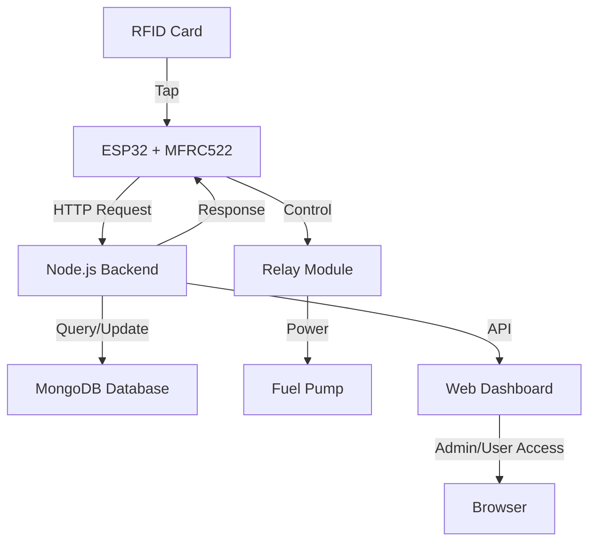

<div align="center">

# ⚡ FastLane Fuel Dispenser System

<video width="800" controls autoplay muted loop>
  <source src="assets/demo video.mp4" type="video/mp4">
  Your browser does not support the video tag.
</video>

### An IoT-Based Automated Fuel Dispensing System with RFID Authentication

[](https://www.espressif.com/en/products/socs/esp32)
[](https://nodejs.org/)
[](https://www.mongodb.com/)
[](https://msme.gov.in/)

> **🏭 MSME Project** | Developed as part of Micro, Small and Medium Enterprises initiative

[Features](#-features) • [Architecture](#-architecture) • [Installation](#-installation) • [API Documentation](#-api-documentation) • [Credits](#-credits)

</div>

---

## 📖 Overview

FastLane Fuel Dispenser System is a complete IoT solution for automated fuel dispensing with RFID-based authentication. The system integrates ESP32 microcontroller, RFID card reader, web-based dashboards, and a Node.js backend to provide seamless fuel dispensing operations with real-time balance management.

## ✨ Features

<table>
<tr>
<td width="50%">

### 🎯 Core Features
- 🔐 **RFID Authentication** - Secure card-based access
- 💰 **Real-time Balance Management** - Track user balances
- 📊 **Multi-role Dashboards** - Admin, User, and Landing pages
- 🔄 **Live Transaction History** - Complete dispense logs
- 📱 **Responsive UI** - Works on all devices
- 🌐 **RESTful API** - Easy integration

</td>
<td width="50%">

### 🛠️ Technical Features
- ⚡ **ESP32-powered** - Fast and reliable
- 🔌 **MFRC522 RFID Reader** - Industry-standard
- 🎛️ **Relay Control** - Pump automation
- 📡 **WiFi Connectivity** - Remote monitoring
- 🗄️ **MongoDB Database** - Scalable storage
- 🐳 **Docker Support** - Easy deployment

</td>
</tr>
</table>

## ️ Architecture

### System Components



### Technology Stack

<table>
<tr>
<th>Layer</th>
<th>Technology</th>
<th>Purpose</th>
</tr>
<tr>
<td><b>Hardware</b></td>
<td>ESP32, MFRC522, Relay Module</td>
<td>IoT device control and RFID reading</td>
</tr>
<tr>
<td><b>Firmware</b></td>
<td>C++ (PlatformIO)</td>
<td>ESP32 programming</td>
</tr>
<tr>
<td><b>Backend</b></td>
<td>Node.js, Express.js</td>
<td>RESTful API server</td>
</tr>
<tr>
<td><b>Database</b></td>
<td>MongoDB, Mongoose</td>
<td>Data persistence</td>
</tr>
<tr>
<td><b>Frontend</b></td>
<td>HTML5, CSS3, JavaScript</td>
<td>User interfaces</td>
</tr>
</table>

## 📁 Project Structure

```
fastlane-fuel-dispenser-system/
├── 📱 esp32/                    # ESP32 firmware
│   ├── src/main.cpp            # Main firmware code
│   ├── include/config.h        # Hardware pin configuration
│   └── platformio.ini          # PlatformIO config
│
├── 🖥️ backend/                  # Node.js API server
│   ├── src/
│   │   ├── server.js           # Express server
│   │   ├── controllers/        # Business logic
│   │   ├── models/             # MongoDB schemas
│   │   ├── routes/             # API endpoints
│   │   └── utils/db.js         # Database connection
│   └── API_DOCUMENTATION.md    # Complete API docs
│
├── 🌐 frontend/                 # Web interfaces
│   ├── admin/                  # Admin dashboard
│   ├── user/                   # User dashboard
│   └── landing/                # Landing page
│
├── ⚙️ config/                   # Configuration files
│   ├── wifi.json               # WiFi credentials
│   ├── server.json             # Server endpoints
│   ├── database.json           # MongoDB config
│   └── constants.json          # System constants
│
├── 🔧 scripts/                  # Automation scripts
│   ├── setup-backend.sh        # Backend setup
│   ├── start-server.sh         # Start server
│   ├── upload-esp32.sh         # Flash ESP32
│   └── deploy.sh               # Full deployment
│
└── 📸 assets/                   # Media files
    ├── components and connection.png
    └── demo video.mp4
```

## 🚀 Installation

### Prerequisites

- **Node.js** (v16 or higher)
- **MongoDB** (v4.4 or higher)
- **PlatformIO** (for ESP32)
- **ESP32 Dev Board**
- **MFRC522 RFID Module**
- **Relay Module**

### Quick Start

#### 1️⃣ Clone the Repository

```bash
git clone https://github.com/ANURA4G/fastlane-fuel-dispenser-system.git
cd fastlane-fuel-dispenser-system
```

#### 2️⃣ Configure Environment Variables

Create a `.env` file in the `backend/` directory from the example:

```bash
cd backend
cp .env.example .env
```

Update the `.env` file with your settings:

```env
# Server Configuration
PORT=3000
NODE_ENV=development

# MongoDB Connection
MONGO_URI=mongodb://localhost:27017/fuel-dispenser

# WiFi Configuration (for ESP32)
WIFI_SSID=YourWiFiSSID
WIFI_PASSWORD=YourWiFiPassword

# Backend Server IP
BACKEND_IP="YOUR-IP"
BACKEND_PORT=3000

# ESP32 IP Address
ESP32_IP="YOUR-IP"
```

> **Note**: Never commit the `.env` file to version control. It contains sensitive credentials.

#### 3️⃣ Setup Backend

```bash
# Run automated setup
./scripts/setup-backend.sh

# Or manually:
cd backend
npm install
npm run seed      # Seed initial data
npm start         # Start server
```

#### 4️⃣ Flash ESP32 Firmware

```bash
# Using the automated script
./scripts/upload-esp32.sh

# Or manually with PlatformIO
cd esp32
pio run --target upload
pio device monitor
```

#### 5️⃣ Access Dashboards

```bash
# Open all dashboards
./scripts/open-dashboards.sh
```

Or manually:
- **Landing Page**: `http://localhost:3000` or open `frontend/landing/index.html`
- **Admin Dashboard**: `frontend/admin/index.html`
- **User Dashboard**: `frontend/user/index.html`

## 🔌 Hardware Setup

### Pin Connections

<table>
<tr>
<th>Component</th>
<th>Pin</th>
<th>ESP32 GPIO</th>
</tr>
<tr>
<td rowspan="6"><b>MFRC522 RFID</b></td>
<td>SDA (SS)</td>
<td>GPIO 21</td>
</tr>
<tr>
<td>SCK</td>
<td>GPIO 18</td>
</tr>
<tr>
<td>MOSI</td>
<td>GPIO 23</td>
</tr>
<tr>
<td>MISO</td>
<td>GPIO 19</td>
</tr>
<tr>
<td>RST</td>
<td>GPIO 22</td>
</tr>
<tr>
<td>VCC/GND</td>
<td>3.3V/GND</td>
</tr>
<tr>
<td><b>Relay Module</b></td>
<td>Signal</td>
<td>GPIO 25</td>
</tr>
<tr>
<td><b>Fuel Pump</b></td>
<td>Power</td>
<td>Via Relay</td>
</tr>
</table>

### Circuit Diagrams

#### Component Connections
<div align="center">

</div>

#### Raw Circuit Diagram
<div align="center">

<p><i>Detailed circuit schematic showing all electronic connections</i></p>
</div>

> **Note**: The complete hardware connection and circuit design was expertly implemented by [**ANURA4G**](https://github.com/ANURA4G) 🔌⚡

## 📡 API Documentation

The system exposes a RESTful API for all operations. See [backend/API_DOCUMENTATION.md](backend/API_DOCUMENTATION.md) for complete details.

### Quick API Reference

<details>
<summary><b>User Management</b></summary>

```http
POST /api/users
GET /api/users/:rfid_uid
PUT /api/users/:rfid_uid
```
</details>

<details>
<summary><b>Financial Operations</b></summary>

```http
POST /api/finance/add-balance
POST /api/finance/dispense
GET /api/finance/balance/:rfid_uid
```
</details>

<details>
<summary><b>Dispense History</b></summary>

```http
GET /api/dispense/history
GET /api/dispense/history/:rfid_uid
```
</details>

<details>
<summary><b>Statistics</b></summary>

```http
GET /api/dispense/stats
```
</details>

### Example Request

```javascript
// Add balance to user
fetch('http://localhost:3000/api/finance/add-balance', {
  method: 'POST',
  headers: { 'Content-Type': 'application/json' },
  body: JSON.stringify({
    rfid_uid: "ABC123",
    amount: 1000
  })
});
```

## 🎨 Dashboards

### Admin Dashboard
- 👥 User management
- 💰 Balance operations
- 📊 Transaction history
- 📈 System statistics
- ⚙️ System configuration

### User Dashboard
- 💳 Personal balance
- 📜 Transaction history
- 👤 Profile management
- 📱 Mobile-friendly

### Landing Page
- 🏠 System overview
- 🔐 Quick access links
- 📱 Responsive design

## 🔧 Configuration Reference

### System Constants (`config/constants.json`)

```json
{
  "admin_rfid_tag": "YOUR_ADMIN_TAG",
  "fuel_rate_per_liter": 100,
  "currency": "Rs",
  "pins": {
    "rst_pin": 22,
    "ss_pin": 21,
    "relay_pin": 25
  }
}
```

## 🧪 Testing

### Backend API Tests
```bash
cd test/backend-tests
./test-api.sh
```

### ESP32 Tests
```bash
cd test/esp32-tests
# Follow test instructions
```

## 🐳 Docker Deployment

```bash
# Build and run with Docker
cd backend
docker build -t fuel-backend .
docker run -p 3000:3000 fuel-backend
```

## 📜 Scripts Reference

| Script | Description |
|--------|-------------|
| `setup-backend.sh` | Install dependencies and setup backend |
| `start-server.sh` | Start the Node.js server |
| `upload-esp32.sh` | Compile and upload ESP32 firmware |
| `monitor-esp32.sh` | Monitor ESP32 serial output |
| `open-dashboards.sh` | Open all web dashboards |
| `deploy.sh` | Complete system deployment |
| `system-check.sh` | Check system health |

## 🔒 Security Features

- ✅ RFID-based authentication
- ✅ Secure balance management
- ✅ Transaction logging
- ✅ Admin access control
- ✅ Input validation
- ✅ CORS protection

## 🐛 Troubleshooting

<details>
<summary><b>ESP32 not connecting to WiFi</b></summary>

- Check WiFi credentials in `.env` file
- Verify ESP32 is in range of WiFi
- Check serial monitor for error messages
</details>

<details>
<summary><b>Backend API not responding</b></summary>

- Ensure MongoDB is running
- Check `MONGO_URI` in `.env` file
- Verify port 3000 is not in use
</details>

<details>
<summary><b>RFID reader not detecting cards</b></summary>

- Check wiring connections
- Verify 3.3V power supply
- Test with known working RFID card
</details>

## 🗺️ Roadmap

- [ ] Mobile app (React Native)
- [ ] SMS notifications
- [ ] Multiple pump support
- [ ] Advanced analytics
- [ ] Cloud deployment
- [ ] Payment gateway integration
- [ ] QR code authentication

## 🤝 Contributing

Contributions are welcome! Please follow these steps:

1. Fork the repository
2. Create a feature branch (`git checkout -b feature/AmazingFeature`)
3. Commit your changes (`git commit -m 'Add some AmazingFeature'`)
4. Push to the branch (`git push origin feature/AmazingFeature`)
5. Open a Pull Request

## ‍💻 Credits

### Hardware & Connection Design

<div align="center">

### 🎖️ [ANURA4G](https://github.com/ANURA4G)

**The mastermind behind the complete hardware connection and circuit design**

<a href="https://github.com/ANURA4G">

</a>

*Special thanks to ANURA4G for the meticulous hardware integration, circuit design, and ensuring all ESP32-RFID-Relay connections work flawlessly! 🔌⚡*

</div>

---

### System Development Team

- **ESP32 Firmware**: Hardware programming and IoT integration
- **Backend Development**: API design and database architecture
- **Frontend Development**: User interface and dashboards
- **System Integration**: End-to-end testing and deployment

## 🌟 Acknowledgments

- ESP32 community for excellent documentation
- MFRC522 library contributors
- Node.js and Express.js teams
- MongoDB team for the robust database
- Open source community

## 📞 Support

For issues, questions, or contributions:
- 🐛 [Open an issue](https://github.com/ANURA4G/fastlane-fuel-dispenser-system/issues)
- 💬 [Discussions](https://github.com/ANURA4G/fastlane-fuel-dispenser-system/discussions)
- 📧 Contact the development team

---

<div align="center">

### ⭐ Star this repository if you find it helpful!

**Made with ❤️ by the FastLane Team**

Hardware Connection Expertise: [ANURA4G](https://github.com/ANURA4G) 🔌

</div>
